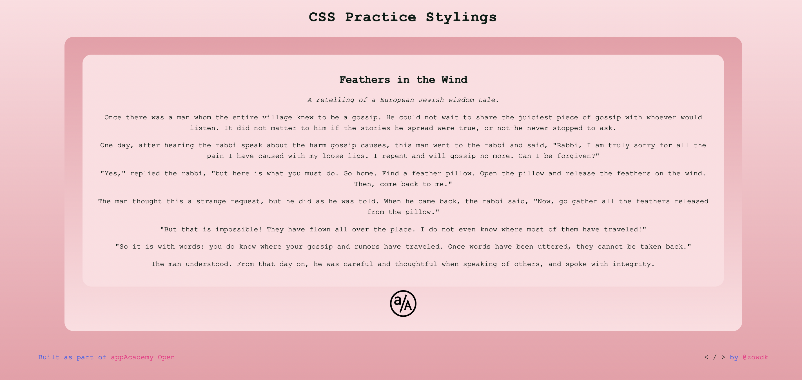

# a/A Open Projects

[app Academy](https://www.appacademy.io/) is a San Francisco-based software engineering bootcamp that offers courses both online and on campus. This repository contains my personal solution to "Styling A Webpage with CSS" as part of [a/A Open](https://www.appacademy.io/course/app-academy-open), the free version of a/A's entire online full-stack curriculum. 

## Styling Practice

The objective was to use CSS to style the provided HTML. 

## Solution

< /  > by [@zowdk](https://twitter.com/zowdk)

